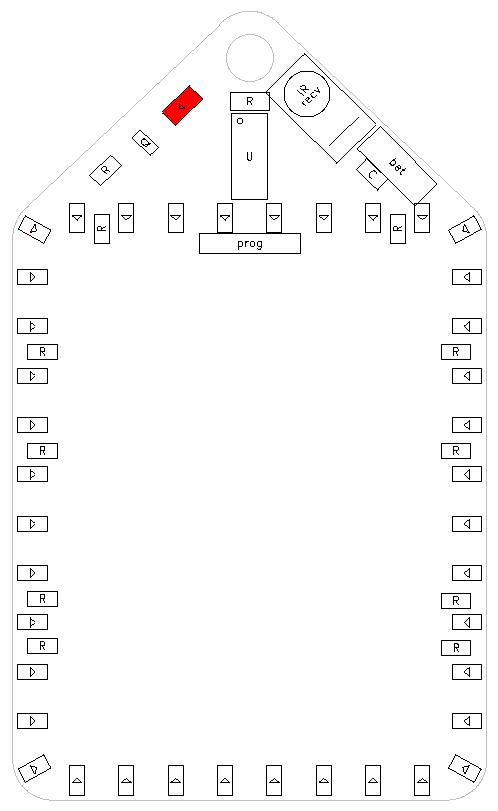

# Component placement
The badge contains 56 SMD and 2 (or 3) through-hole components. Regardless of your fabrication method (solder paste & reflowing OR manual soldering) it is best to start with the SMD components, and place these in a specific order.

Step 1: Place the LEDs in the correct orientation. Use a mirror if necessary.

Step 2: Place the 220 Ohm resistors. Orientation is not important, but place them with the black side up.

Step 3: Place the 1kOhm gate protection resistor. Orientation is not important, but place it with the black side up.

Step 4: Place the mosfet. The mosfet will fit only in one orientation.

Step 5: Place the IR LED in the correct orientation.

Step 6: Place the (large) 22 Ohm protection resistor. Orientation is not important, but place it with the black side up.

Step 7: Place the 100nF capacitor. Orientation is not important.

Step 8: Place the PADAUK microprocessor in the correct orientation

If you are doing reflow soldering, you now need to do the reflowing - before mounting the through-hole components.

Step 9: Bend the legs of the IR receiver 90 degrees so that the receiver lens will look UP from the PCB and mount it.

Step 10: fix the battery holder to the other side of the PCB using double-sided tape. Shorten the wires a bit, and solder them onto the battery connection pads (square pad = minus).

Step 11: (if wanted) solder a 5 pin pin header into the programming connection. Note that In Circuit Reprogramming can be done, but clock speed calibration may not work. If this is the case, you need to run easypdkprog with the --nocalibrate option.

Step 12: insert batteries and enjoy your badge!
